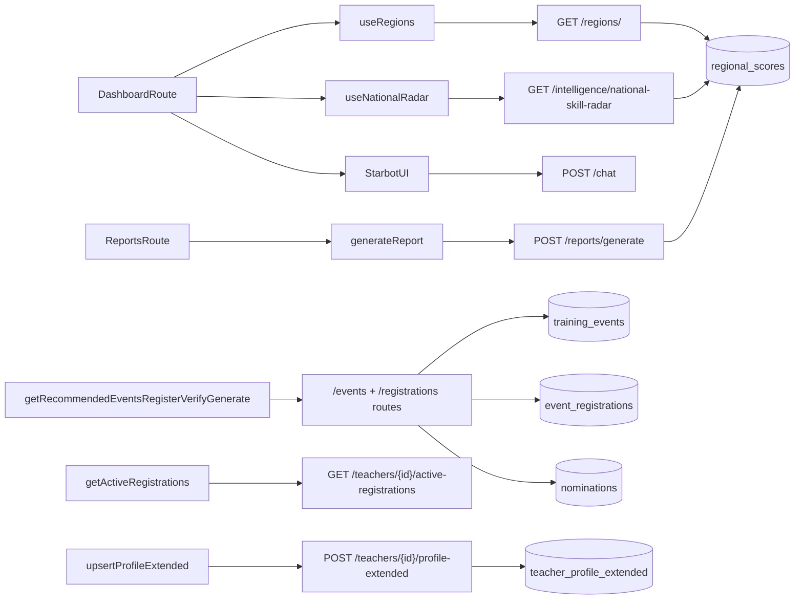

# POLARIS Current State Audit (2026-04-16)

## Executive Snapshot

POLARIS is currently a **hybrid state**:
- **v3.4 Prompt C1-C4** work is largely implemented (typed frontend contracts, reports route/page, STARBOT chip + streaming behavior, dashboard/report shell integration).
- **v3.1 full MVP parity** is not complete, especially teacher app flows and many v3.1 API endpoints.
- Backend has a strong **v3.4 registration/reporting path**, while several v3.1 data-processing and teacher CRUD endpoints are missing.
- Database schema includes both v3.1 core and v3.4 additions, but seed/migration execution order in docs is inconsistent with SQL dependencies.

---

## Prompt Progress (Blueprint C.1-C.8)

### Completed (evidence in repo)
- **C.1 TypeScript types + API wrappers**
  - `frontend/src/types/polaris.ts`
  - `frontend/src/lib/api.ts`
- **C.2 Sidebar + Reports route**
  - `frontend/src/components/dashboard/Sidebar.tsx` (reports enabled)
  - `frontend/src/App.tsx` (`/reports` under `DashboardLayout`)
- **C.3 STARBOT update + fake streaming**
  - `frontend/src/components/starbot/StreamingResponse.jsx`
  - `frontend/src/components/starbot/Starbot.jsx` (chips, copy button, region_context pass-through)
- **C.4 Report Generator page**
  - `frontend/src/pages/ReportGenerator.jsx`
  - `frontend/src/components/reports/ReportConfigPanel.jsx`
  - `frontend/src/components/reports/ReportPreviewPanel.jsx`
  - `frontend/src/components/reports/ReportTypeCard.jsx`

### Not implemented yet (or not present in mounted app)
- **C.5 Onboarding flow**
- **C.6 Home tab restructure + active registrations list in teacher app**
- **C.7 Recommended events upgrade in teacher Training tab**
- **C.8 Full sign-up flow verify/generate/success UX in teacher frontend**

No active `/teacher/*` route is mounted in `frontend/src/App.tsx`.

---

## Backend/API Inventory

## Implemented and mounted routes
From `api/main.py` + routers:
- `GET /health`
- `GET /regions/`
- `GET /intelligence/national-skill-radar`
- `POST /chat`
- `POST /reports/generate`
- `GET /events/recommended`
- `POST /events/{event_id}/register`
- `POST /registrations/{reg_id}/verify`
- `POST /registrations/{reg_id}/generate-pds`
- `PATCH /registrations/{reg_id}/status`
- `GET /teachers/{deped_id}/active-registrations`
- `POST /teachers/{deped_id}/profile-extended`
- `GET /downloads/{filename}`

## v3.1 endpoints not implemented
Not found in current mounted routers:
- `GET /regions/{region_name}/profile`
- `GET /regions/{region_name}/nat-trends`
- `GET /regions/{region_name}/demand-topics`
- `GET /teachers/{deped_id}/profile`
- `GET /teachers/{deped_id}/trainings`
- `GET /teachers/{deped_id}/nominations`
- `POST /teachers/{deped_id}/need`
- `POST /trainings/{training_id}/feedback`
- `POST /teachers/{deped_id}/nominate`
- `PATCH /teachers/{deped_id}`
- `POST /upload/csv`
- `POST /extract/document`
- `POST /admin/recompute-tvi`
- `POST /admin/recompute-regional-scores`
- `POST /admin/process-needs-signals`
- `POST /admin/process-ppst-tags`

## Contract drifts to watch
- `POST /chat` currently returns a guard message when `region_context` is null; it does not execute a national-context query path.
- `GET /intelligence/national-skill-radar` uses frontend axis names (`learning_environment`, `assessment_reporting`, etc.) that diverge from strict v3.1 PPST key naming.
- `GET /regions/` returns `region_code` (computed), but does not expose every v3.1-listed field such as `computed_at` in the response model.

---

## Frontend Inventory

## Implemented routes/pages
- `/` -> `frontend/src/pages/Dashboard.tsx`
- `/reports` -> `frontend/src/pages/ReportGenerator.jsx`

## Dashboard status (current)
- **Map-first floating layout** is implemented (`Dashboard.tsx` + `MapCanvas.tsx`).
- **Panel-like content exists**: PPST radar, critical pings feed, regional/national right card.
- **STARBOT overlay** is implemented with chip prompts and streaming message rendering.
- **Reports page** is integrated and functional from sidebar route.

## Known dashboard divergences from strict v3.1 layout
- Uses floating rails and top bar rather than strict 20/40/40 bento.
- `NationalBaselineCard` donut is custom/conic and not traffic-light count donut as specified in v3.1 text.
- `RegionalHealthCard` is `summary/demand/impact` tabs (no separate detail tab wrapper).
- `MapCanvas` does not implement explicit demand-lens inverted color logic in a dedicated branch; same score-to-color function is reused.
- Critical ping section title is "AI Reports" rather than "AI Critical Pings."

## Teacher interface status
- No mounted `TeacherApp` route in `App.tsx`.
- `frontend/src/components/teacher/` has no implemented teacher feature components in this app path.
- C5-C8 teacher frontend goals are pending.

---

## Data Layer / Migration State

## Schema status
- `db/migrations/001_init.sql` contains core v3.1 schema (teachers/trainings/needs_signals/nominations/regional_scores/etc.) with PPST + critical ping fields.
- `db/migrations/003_v34_module4_and_starbot.sql` adds v3.4 objects:
  - `registration_status` enum
  - `teacher_profile_extended`
  - `training_events`
  - `event_registrations`

## Seed readiness status
- `db/migrations/002_seed.sql` currently focuses on v3.4 demo seed blocks.
- The file itself states 003 should run first due to dependencies.
- `README.md` lists order as `001 -> 002 -> 003`, which conflicts with seed prerequisites.

## Practical migration risk
- Fresh DB execution with README order can fail if 002 inserts reference 003 tables not yet created.

---

## API <-> DB <-> Frontend Connection Map (Live)

---

## Implemented / Partial / Missing Matrix

| Area | Status | Notes |
|---|---|---|
| Dashboard shell + map + starbot | Implemented (customized) | Working but with intentional/accidental drift from strict v3.1 panel semantics |
| Report Generator (C4) | Implemented | Connected to `/reports/generate` |
| Registration lifecycle APIs | Implemented | register/verify/generate/status/active list present |
| Extended profile upsert API | Implemented | POST upsert available |
| v3.1 teacher profile/trainings/needs/nomination endpoints | Missing | Not mounted |
| v3.1 admin recompute/process endpoints | Missing | Not mounted |
| v3.1 upload/extract endpoints | Missing | Not mounted |
| Teacher frontend app (C5-C8) | Missing in app router | No `/teacher/*` in `App.tsx` |
| DB v3.1 + v3.4 tables | Implemented | Present in SQL migrations |
| Seed + migration execution consistency | Partial | README order and 002 prerequisites conflict |

---

## Highest-Priority Gaps (Ranked)

1. **Teacher frontend path is not mounted**  
   Add `/teacher/*` route and wire onboarding/home/training/sign-up flows (C5-C8).

2. **Core v3.1 teacher/data APIs are absent**  
   Add missing teacher read/write and admin processing endpoints if v3.1 parity remains required.

3. **Migration/seed runbook mismatch**  
   Align SQL execution order and seed assumptions so fresh setup is deterministic.

4. **Radar axis/schema consistency**  
   Decide one canonical axis naming set (strict PPST vs current aliases) and align backend + frontend + docs.

5. **Map demand-lens semantics**  
   Implement explicit demand inversion branch and legend behavior if strict v3.1 UX fidelity is required.

---

## Recommended Next Execution Sequence

1. **Decide target contract:**  
   lock whether the source of truth is strict v3.1, v3.4 blueprint C1-C8, or a merged profile.

2. **Unblock data bootstrap:**  
   fix migration/seed order in docs/scripts, then verify fresh DB setup end-to-end.

3. **Finish Phase C frontend (C5-C8):**  
   route mounting, onboarding, active registrations top-of-home, recommended events, sign-up state machine.

4. **Backfill missing API contracts:**  
   implement whichever v3.1/v3.4 endpoints your active frontend must call.

5. **Run full happy-path verification:**  
   execute dashboard + teacher flow script with pitch mode and validate no contract mismatches.

---

## Conclusion

You are correctly at a **post-C4 inflection point**: dashboard/report enhancements are already in place, and the major unfinished surface is the **teacher journey + any remaining contract harmonization** between v3.1 and v3.4 expectations.
